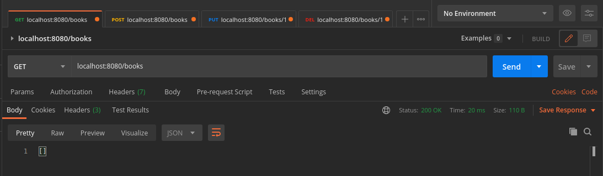
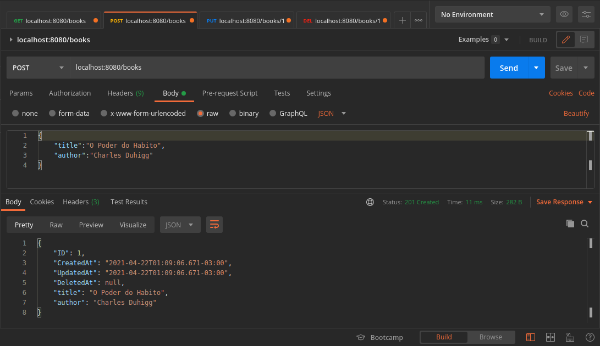
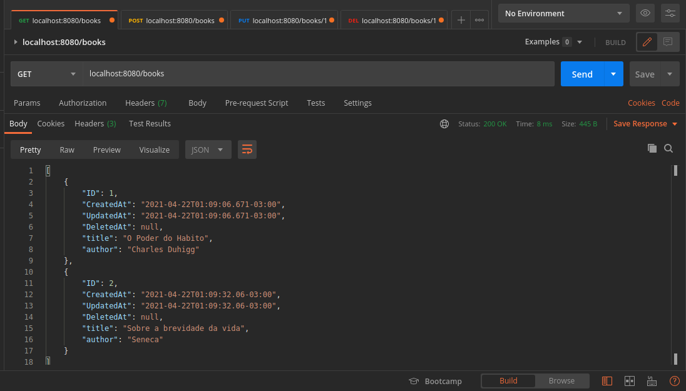
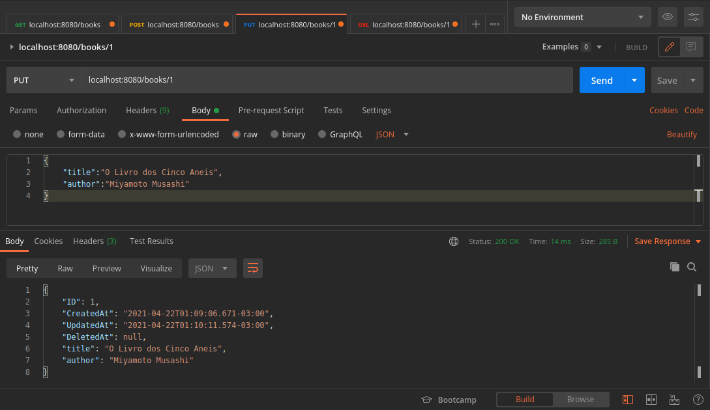
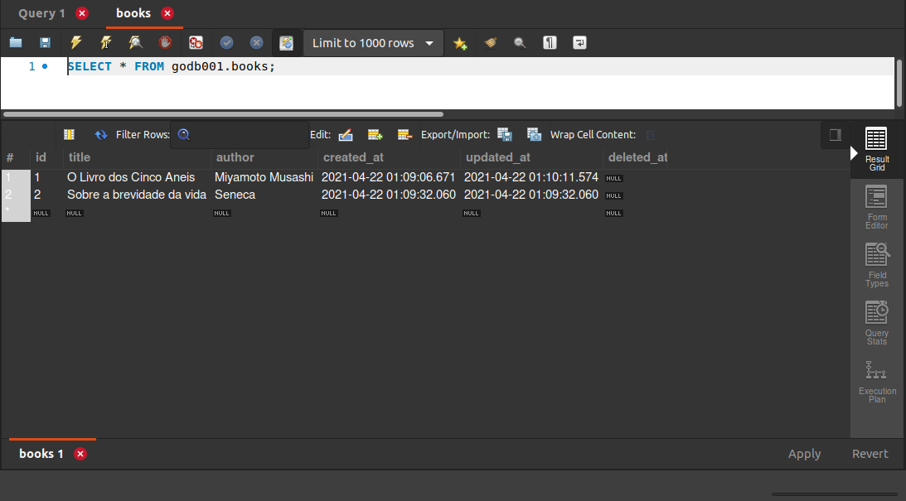
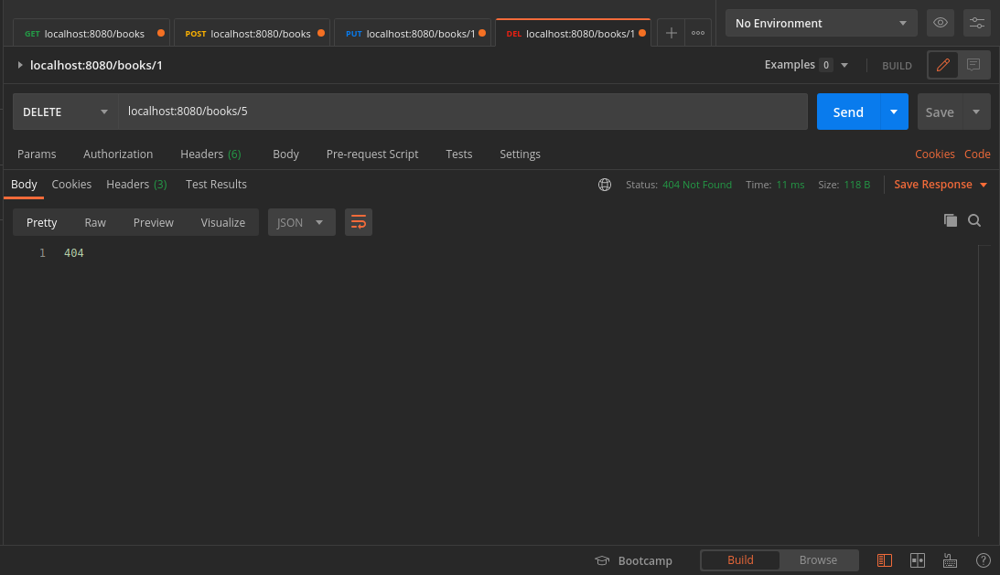
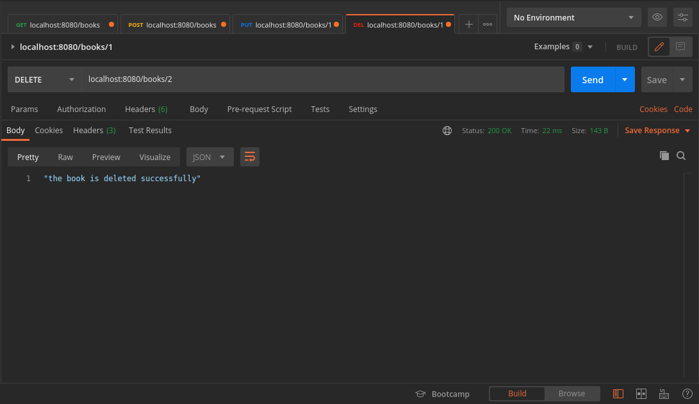
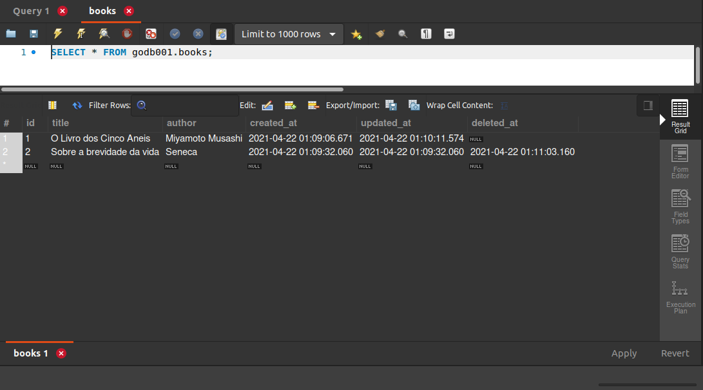

# Book manager Rest API Go/MySQL
## API Restful que utiliza livros como exemplo

<p align="center">
  
</p>


A aplicação foi escrita totalmente em Go 🐹, visando utilizar o mínimo de dependências possíveis, tratar a maioria dos erros com os devidos cuidados e documentada com comentários de fácil entendimento

Pacotes utilizados

- Gorilla/Mux 🦍
- GORM


## Features

- Na aplicação é possível ver os livros já adicionados previamente
- Adicionar novos livros
- Ver livros específicos
- Excluir algum livros desejado
- Atualizar as informações


## Requisitos

```sh
Golang: https://golang.org/dl/
MySQL instalado e configurado com as configurações desejadas (editar no arquivo credentials.go)
API Client de sua preferência (O que aparece nas imagens se chama Postman)

Após ter instalado o go
Gorilla mux: go get -u github.com/gorilla/mux
GORM: go get -u gorm.io/gorm
```


## Na prática

Iniciando a aplicação


Acessando os livros já inseridos




Adicionando novos livros







Atualizando o livro desejado






Deletando o livro desejado








## Utilização

Basta utilizar o comando go build e aproveitar o aplicativo! 😊
